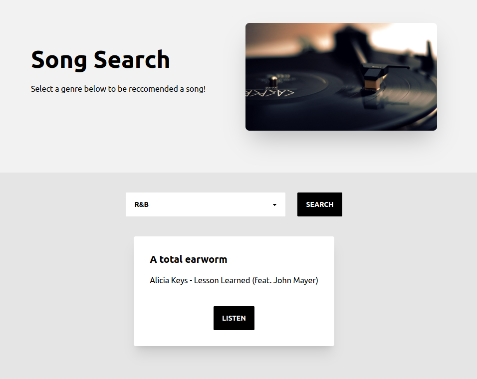

This app allows the user to select a genre to find a song to search for. It leverages the spotify Web API and does require you to be signed into a spotify account.

The Spotify Web Player SDK requires a spotify premium account, so for the sake of accessiblity, I opted to use the retrieved song data from the spotify web api, and search the song on YouTube using their YouTube Data api. The reccomended song plays in the browser, and you can listen to your hearts content!

